<picture>
  <source media="(prefers-color-scheme: dark)" srcset="assets/card-dark.svg">
  
</picture>

### Tools

**[skillprobe](https://github.com/drakeo338/skillprobe)** lints agent skills: will it trigger, what does it cost on every turn, does it collide with another one.

**[hookprobe](https://github.com/drakeo338/hookprobe)** does the same for Claude Code hooks, against the real event schema: events that don't exist, tool-name casing that quietly never matches, matchers on events that ignore them.

Both got most of their accuracy from running against real shipped configs instead of my own fixtures. That's how I found out my fixtures agreed with my bugs.

### Merged upstream

| Project | Fix |
|---|---|
| [langchain-ai/openwiki #914](https://github.com/langchain-ai/openwiki/pull/914) | Replace a legacy OpenWiki section instead of appending a duplicate |
| [maplibre/maplibre-gl-js #8553](https://github.com/maplibre/maplibre-gl-js/pull/8553) | Globe camera no longer throws when padding exceeds the viewport |
| [Tencent/BrowserSkill #283](https://github.com/Tencent/BrowserSkill/pull/283) | Re-arm lazy tools from history after a plugin reload |
| [jsverse/transloco #1026](https://github.com/jsverse/transloco/pull/1026) | Honor the sort option for `.pot` output |
| [neomjs/neo #19154](https://github.com/neomjs/neo/pull/19154) | `isA()` walks past `component.Base` to any ancestor |
| [debpalash/VoiceStudio #2174](https://github.com/debpalash/VoiceStudio/pull/2174) | Name every Kokoro language from the installed table |
