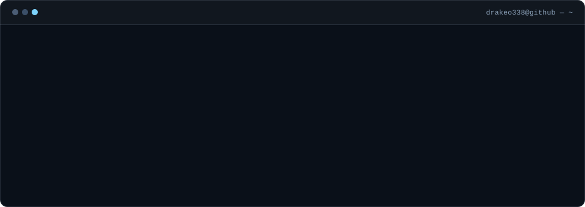

<picture>
  <source media="(prefers-color-scheme: dark) and (max-width: 640px)" srcset="assets/card-dark-m.svg">
  <source media="(max-width: 640px)" srcset="assets/card-light-m.svg">
  <source media="(prefers-color-scheme: dark)" srcset="assets/card-dark.svg">
  
</picture>

<picture>
  <source media="(max-width: 640px)" srcset="assets/terminal-m.svg">
  
</picture>

<a href="https://younesberiane.github.io">younesberiane.github.io</a>

  <picture>
    <source media="(prefers-color-scheme: dark)" srcset="https://streak-stats.demolab.com?user=drakeo338&hide_border=true&background=00000000&ring=7dd3fc&fire=7dd3fc&currStreakNum=e5edf7&sideNums=e5edf7&currStreakLabel=8fd3ff&sideLabels=97a5ba&dates=76849c&stroke=1e293b">
    
  </picture>

  <picture>
    <source media="(prefers-color-scheme: dark)" srcset="https://skillicons.dev/icons?i=py%2Cts%2Cjs%2Crust%2Cgo%2Cbash&theme=dark">
    
  </picture>

### Merged upstream

<!-- merged:start -->
| Project | Stars | Fix |
|---|--:|---|
| [openclaw/openclaw #161454](https://github.com/openclaw/openclaw/pull/161454) | 391.2k | Pass the responding agent to summary model acquisition |
| [mrdoob/three.js #34729](https://github.com/mrdoob/three.js/pull/34729) | 116.1k | WebGLBackend: Fix clear() with a disabled color write mask. |
| [ruvnet/ruflo #3571](https://github.com/ruvnet/ruflo/pull/3571) | 73.7k | Validate namespace on memory store and memory import |
| [code-yeongyu/oh-my-openagent #9242](https://github.com/code-yeongyu/oh-my-openagent/pull/9242) | 69.7k | Sandbox OMO_MEMORY_HOME in isolatedChildEnv |
| [tw93/Pake #1393](https://github.com/tw93/Pake/pull/1393) | 61.9k | Set `StartupWMClass` so Linux docks match the window to its launcher |
| [multica-ai/multica #8967](https://github.com/multica-ai/multica/pull/8967) | 51.8k | MUL-7816 fix(taskfailure): classify a 403 usage limit as provider quota, not auth |
| [debpalash/VoiceStudio #2174](https://github.com/debpalash/VoiceStudio/pull/2174) | 51.5k | Name every Kokoro language from the installed table |
| [debpalash/VoiceStudio #2444](https://github.com/debpalash/VoiceStudio/pull/2444) | 51.5k | Say a long reference is too long when no speech-to-text model is installed |
| [zhayujie/CowAgent #3357](https://github.com/zhayujie/CowAgent/pull/3357) | 47.2k | Find the git sub-command after global options in read-only mode |
| [vectorize-io/hindsight #4752](https://github.com/vectorize-io/hindsight/pull/4752) | 44.4k | Pass `anthropic.Timeout` so requests stop failing on anthropic 1.x |
| [solidjs/solid #3716](https://github.com/solidjs/solid/pull/3716) | 36.1k | A run that committed undefined is not WASTED_RECOMPUTE |
| [qdrant/qdrant #10870](https://github.com/qdrant/qdrant/pull/10870) | 34.9k | Fix merge and search with an empty multivector placeholder |
| [t8y2/dbx #10275](https://github.com/t8y2/dbx/pull/10275) | 23.8k | Suggest columns inside select-list function calls (Fixes #10170) |
| [dream-num/univer #7744](https://github.com/dream-num/univer/pull/7744) | 22.3k | Reposition help card as formula text grows |
| [eosphoros-ai/DB-GPT #3264](https://github.com/eosphoros-ai/DB-GPT/pull/3264) | 20.1k | Connector confirm endpoints now require the API key |
| [langchain-ai/openwiki #914](https://github.com/langchain-ai/openwiki/pull/914) | 16.9k | Replace a legacy OpenWiki section instead of appending a duplicate |
| [opensandbox-group/OpenSandbox #2082](https://github.com/opensandbox-group/OpenSandbox/pull/2082) | 15.6k | Skip pause dispatch for an already Paused BatchSandbox |
| [maplibre/maplibre-gl-js #8553](https://github.com/maplibre/maplibre-gl-js/pull/8553) | 11.8k | Globe camera no longer throws when padding exceeds the viewport |
| [maplibre/maplibre-gl-js #8554](https://github.com/maplibre/maplibre-gl-js/pull/8554) | 11.8k | Color relief no longer packs to NaN when a DEM channel factor is 0 |
| [alvinunreal/oh-my-opencode-slim #1369](https://github.com/alvinunreal/oh-my-opencode-slim/pull/1369) | 9.2k | Keep checkpoint snapshot ids unique across restarts |
| [Tencent/BrowserSkill #283](https://github.com/Tencent/BrowserSkill/pull/283) | 8k | Re-arm lazy tools from history after a plugin reload |
| [MakazhanAlpamys/Soup #1256](https://github.com/MakazhanAlpamys/Soup/pull/1256) | 8k | Slice per-layer config lists so shrunk models save again |
| [MakazhanAlpamys/Soup #1377](https://github.com/MakazhanAlpamys/Soup/pull/1377) | 8k | Strip ANSI/wrap before asserting the #808 guard stayed silent |
| [MakazhanAlpamys/Soup #1382](https://github.com/MakazhanAlpamys/Soup/pull/1382) | 8k | Resolve the #361 harness's source SHA from soup_cli's tree, not the checkout's HEAD |
| [MakazhanAlpamys/Soup #1454](https://github.com/MakazhanAlpamys/Soup/pull/1454) | 8k | Keep the previous artifact when reward synth or adapter fuse fails |
| [MakazhanAlpamys/Soup #1456](https://github.com/MakazhanAlpamys/Soup/pull/1456) | 8k | Thread --trust-remote-code to every load it was silently dropped from |
| [MakazhanAlpamys/Soup #1460](https://github.com/MakazhanAlpamys/Soup/pull/1460) | 8k | Honor --device instead of hard-coding device_map=auto |
| [MakazhanAlpamys/Soup #1473](https://github.com/MakazhanAlpamys/Soup/pull/1473) | 8k | Keep DoRA off on GPTQ/AWQ/AQLM/EETQ bases |
| [MakazhanAlpamys/Soup #1479](https://github.com/MakazhanAlpamys/Soup/pull/1479) | 8k | Honour --device in the transformers loader |
| [repowise-dev/repowise #2632](https://github.com/repowise-dev/repowise/pull/2632) | 7.1k | Surface a fetch error in TestsReachingList |
| [repowise-dev/repowise #2639](https://github.com/repowise-dev/repowise/pull/2639) | 7.1k | Keep a matched rg path even at the repo root |
| [ArcReel/ArcReel #2787](https://github.com/ArcReel/ArcReel/pull/2787) | 5.3k | 为 Gemini 3.1 Flash Lite 与 Qwen3.6 Plus / Flash 声明图片理解能力 |
| [TabularisDB/tabularis #831](https://github.com/TabularisDB/tabularis/pull/831) | 5.1k | Restore DataGrid scroll position across tab switches |
| [TabularisDB/tabularis #838](https://github.com/TabularisDB/tabularis/pull/838) | 5.1k | Keep scroll position of grids in multi-result panel |
| [conorbronsdon/avoid-ai-writing #359](https://github.com/conorbronsdon/avoid-ai-writing/pull/359) | 4.8k | Require a vague close for false-concession |
| [ministackorg/ministack #1855](https://github.com/ministackorg/ministack/pull/1855) | 4.8k | Report a bare-string RIE timeout as a function error |
| [eugeniughelbur/obsidian-second-brain #310](https://github.com/eugeniughelbur/obsidian-second-brain/pull/310) | 4.7k | Resolve `bash` by path so WSL's launcher never runs the test suite |
| [kirodotdev/KiroCrew #15120](https://github.com/kirodotdev/KiroCrew/pull/15120) | 4.2k | Keep the answer visible when a recycle notice trails it |
| [kirodotdev/KiroCrew #15127](https://github.com/kirodotdev/KiroCrew/pull/15127) | 4.2k | Keep deleted semantic facts deleted on automated writes |
| [skyhook-io/radar #1895](https://github.com/skyhook-io/radar/pull/1895) | 3.6k | Detect revisioned `istiod` deployments by label |
| [neomjs/neo #19154](https://github.com/neomjs/neo/pull/19154) | 3.3k | `isA()` walks past `component.Base` to any ancestor |
| [snapotter-hq/SnapOtter #1229](https://github.com/snapotter-hq/SnapOtter/pull/1229) | 2.8k | Auto-orient no longer re-compresses photos at default quality |
| [snapotter-hq/SnapOtter #1230](https://github.com/snapotter-hq/SnapOtter/pull/1230) | 2.8k | Reject non-finite zoom so a zero-distance pinch can't store NaN |
| [snapotter-hq/SnapOtter #1231](https://github.com/snapotter-hq/SnapOtter/pull/1231) | 2.8k | Log a failed deep-enhance pass instead of swallowing it |
| [snapotter-hq/SnapOtter #1247](https://github.com/snapotter-hq/SnapOtter/pull/1247) | 2.8k | Importer catches dropped rows on a pre-populated `--force` target |
| [snapotter-hq/SnapOtter #1638](https://github.com/snapotter-hq/SnapOtter/pull/1638) | 2.8k | Accept a missing memory.max at the cgroup v2 root |
| [snapotter-hq/SnapOtter #1650](https://github.com/snapotter-hq/SnapOtter/pull/1650) | 2.8k | Keep DATA_DIR and LOG_DIR inside each fork's own directory |
| [snapotter-hq/SnapOtter #1663](https://github.com/snapotter-hq/SnapOtter/pull/1663) | 2.8k | Stop the split tile busy timer outliving its download |
| [snapotter-hq/SnapOtter #1667](https://github.com/snapotter-hq/SnapOtter/pull/1667) | 2.8k | Let 5xx errors through the tool routes' 422 catch-all |
| [rust-lang/libc #5560](https://github.com/rust-lang/libc/pull/5560) | 2.6k | Freebsd: Add `AT_RENAME_*` and `RENAME_*` constants |
| [jsverse/transloco #1026](https://github.com/jsverse/transloco/pull/1026) | 2.3k | Honor the sort option for `.pot` output |
| [zzet/gortex #826](https://github.com/zzet/gortex/pull/826) | 1.8k | Skip comments and string literals in the VB.NET call scan |
| [zzet/gortex #842](https://github.com/zzet/gortex/pull/842) | 1.8k | Install user-level hooks into ~/.claude/settings.json |
| [LargeModGames/spotatui #648](https://github.com/LargeModGames/spotatui/pull/648) | 1.4k | Show the rebound key in on-screen hints, not the default |
| [unstablebuild/rune #141](https://github.com/unstablebuild/rune/pull/141) | 1.2k | Space toggles multi-select boxes, and Enter no longer submits nil |
| [reticlehq/reticle #1169](https://github.com/reticlehq/reticle/pull/1169) | 1.1k | Read a native label for any labelable element, not just form fields |
| [reticlehq/reticle #1170](https://github.com/reticlehq/reticle/pull/1170) | 1.1k | Stop telling a bare-getter store that no store is registered |
| [reticlehq/reticle #1182](https://github.com/reticlehq/reticle/pull/1182) | 1.1k | Stop treating a bumped version token as a dropped write |
| [reticlehq/reticle #1183](https://github.com/reticlehq/reticle/pull/1183) | 1.1k | Recognise a corepack-only package manager instead of refusing it |
| [reticlehq/reticle #1188](https://github.com/reticlehq/reticle/pull/1188) | 1.1k | Reject unrecognised seedStorage keys instead of stripping them |
| [reticlehq/reticle #1192](https://github.com/reticlehq/reticle/pull/1192) | 1.1k | Count a live session as connection evidence in initialize |
| [rust-fuzz/arbitrary #242](https://github.com/rust-fuzz/arbitrary/pull/242) | 883 | Move `derive_arbitrary` to syn 3 and raise the MSRV to 1.71 |
| [desplega-ai/agent-swarm #1652](https://github.com/desplega-ai/agent-swarm/pull/1652) | 850 | Accept the dsh provider in PricingProviderSchema |
| [bazelbuild/rules_rust #4282](https://github.com/bazelbuild/rules_rust/pull/4282) | 847 | Set the Apple deployment target for rustc from the linker args |
| [Harry-kp/vortix #361](https://github.com/Harry-kp/vortix/pull/361) | 704 | Add h/l as panel-nav aliases to help and docs |
| [apmantza/pi-lens #3486](https://github.com/apmantza/pi-lens/pull/3486) | 453 | Mark late auxiliary coverage at notify time, not at ceiling expiry |
| [apmantza/pi-lens #3643](https://github.com/apmantza/pi-lens/pull/3643) | 453 | Match latency report by path, not length delta (closes #3642) |
| [Cotal-AI/Cotal #2252](https://github.com/Cotal-AI/Cotal/pull/2252) | 306 | Forward observe through the worker bridge |
| [selimfirat/pysad #213](https://github.com/selimfirat/pysad/pull/213) | 296 | Accept plain lists in PYODScoreEnsembler.transform_partial |
| [StellarTickets/backend #322](https://github.com/StellarTickets/backend/pull/322) | 0 | Normalize email to lowercase on register and login |
<!-- merged:end -->

  <picture>
    <source media="(prefers-color-scheme: dark)" srcset="https://raw.githubusercontent.com/drakeo338/drakeo338/output/github-snake-dark.svg">
    
  </picture>

In memory of Drakeo the Ruler (1993-2021)

